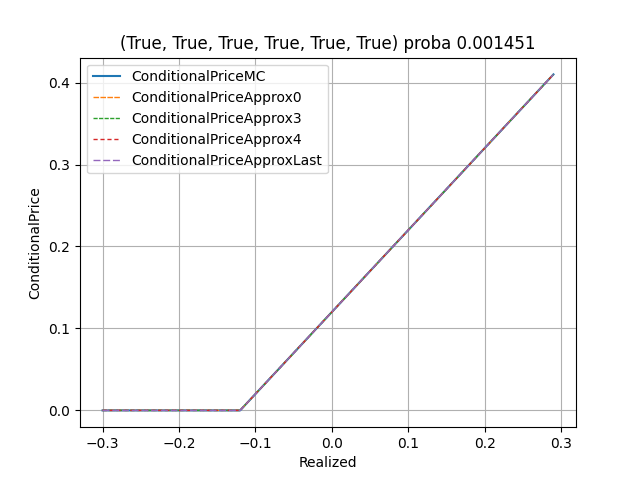

This document introduces an analytical method to compute prices of cliquet in Black-Scholes model. The main idea is to condition the payoff on returns hitting the caps for each periods, and use Edgeworth expansion to approximate the conditional probability density.

# Cliquet Payoff

$$Cliquet = \max\left(0, \sum_i \left\lbrace\min\left(S_i - 1, c_i \right) \right\rbrace + r \right)$$

- $S_i$ is the return on period $i$
- $c_i$ is the cap for the return on period $i$ (they are usually the same for each period)
- $r$ is the realized returns, it conceptually represents the sum of capped returns for the previous periods - it can also be used to adjust the floor
- $i\in \lbrace 1, \dots, n\rbrace$ is the index of the period, $n$ is the number of periods (one period is typically a month or a year)

# Model

- Black-Scholes model, lognormal returns with no drift,

- allows term-structure of volatility,
but no smile.

- define $\sigma^2_i$ as the total variance on period $i$ - to save on notations, we don't use annualized volatilities

$$S_i \sim \exp \left\lbrace 
    -\frac12 \sigma_i^2
    + \sigma_i z_i
\right\rbrace$$

where $z_i \sim \mathcal{N}(0, 1)$, standard Gaussian

# Computation

## Conditioning

$$
\min\left(S_i - 1, c_i\right) \sim
\begin{cases}
c_i & \mathrm{with \; probability} \; p_i\\
X_i -1& \mathrm{with \; probability} \; 1 - p_i
\end{cases}
$$

- $p_i$ is the probability that the return hits the cap, it can be computed explicitly
- $X_i$ is a truncated log-normal

$$\mathbb{E}(Cliquet) =\sum_{\mathcal{I} \subset \mathcal{P}(\lbrace 1, \dots,n\rbrace)}\left\lbrace
    \prod_{i \in \mathcal{I}} p_i \prod_{i \notin \mathcal{I}} (1-p_i)
    \cdot
    \mathbb{E}\left[
    \max\left(
        0, 
        \sum_{i \in \mathcal{I}} c_i
        + \sum_{i \notin \mathcal{I}} (X_i - 1)
        + r
    \right)
    \right]
\right\rbrace
$$

### Probability formula

$$p_i = 1- \Phi(g_i(1+c_i))$$

$$1 - p_i = \Phi(g_i(1+c_i))$$

- $\Phi$ is the cumulative normal probability function.
- $g_i(y) = \frac{\log(y)}{\sigma_i} + \frac12 \sigma_i$

### Truncated log-normals

Density function
$$\phi_i(x) = \frac{1}{1- p_i} \phi(x) f_i(x) \; \mathbb{1}_{f_i(x) < 1 + c_i}$$

- $\phi$ is the gaussian density function
- $f_i(x) = \exp \left\lbrace -\frac12 \sigma_i^2 + \sigma_i x \right\rbrace$

#### Moments

$$\mu_{i,\alpha} = \mathbb{E}\left[ X_i^\alpha \right]$$

$$\mu_{i,\alpha} = 
\exp\left\lbrace\frac12 \sigma_i^2 \alpha (\alpha - 1)\right\rbrace 
\frac{\Phi(g_i(1+c_i) - \sigma_i \alpha)}{\Phi(g_i(1+c_i))}
$$

## Conditional payoff computation

The quantity of interest is call-option on sum of an arbitrary number of truncated log-normals:

$$
    C_\mathcal{I} = \mathbb{E}\left[
    \max\left(
        0, 
        \sum_{i \in \mathcal{I}} c_i
        + \sum_{i \notin \mathcal{I}} (X_i - 1)
        + r
    \right)
    \right]
$$

- Calling $Y=\sum_{i \notin \mathcal{I}} X_i$,

$$C_\mathcal{I} = \int_{\lbrace
            (\sum_{i \notin \mathcal{I}} 1)
            - (\sum_{i \in \mathcal{I}} c_i)
            - r \rbrace}^{\sum_{i \notin \mathcal{I}} (1+c_i)}
    \left(x - \left\lbrace
            (\sum_{i \notin \mathcal{I}} 1)
            - (\sum_{i \in \mathcal{I}} c_i)
            - r \right\rbrace\right) \; \phi_Y(x) \; \mathrm{d}x
$$
 
- $\phi_Y$ is the probability density function of the sum of truncated log-normals

### Cumulants

Can be computed from moments (from Wikipedia - not getting deeper on how they are computed):

$$\kappa_2 = \mu_2$$

$$\kappa_3 = \mu_3$$

$$\kappa_4 = \mu_4 - 3 \mu_2^4$$

$$\kappa_5 = \mu_5 - 10\mu_3\mu_2$$

$$\kappa_6 = \mu_6 -15\mu_4\mu_2 -10\mu_3^2 + 30 \mu_2^3$$

- cumulants are additive: cumulants for a sum is the sum of cumulants 

### Hermite polynomials and Gaussian density function

Just writing a few useful formulae that will be useful for integration.

$$\phi^{(n)}(x) = (-1)^n He_n(x) \phi(x)$$

$$x\phi(x) \to -\phi(x)$$

$$He_n(x)\phi(x) \to - He_{n-1}(x)\phi(x)$$

$$x He_n(x)\phi(x) \to - x He_{n-1}(x)\phi(x) + He_{n-2}(x)\phi(x) $$

#### Hermite Polynomials

$$He_0(x) = 1$$

$$He_1(x) = x$$

$$He_2(x) = x^2 - 1$$

$$He_3(x) = x^3 - 3 x$$

$$He_4(x) = x^4 - 6 x^2 + 3$$

$$He_5(x) = x^5 - 10 x^3 + 15x$$

$$He_6(x) = x^6 - 15 x^4 + 45 x^2 - 15$$

$$He_7(x) = x^7 - 21 x^5 + 105 x^3 - 105x$$

$$He_8(x) = x^8 - 28 x^6 + 210 x^4 - 420 x^2 + 105$$

$$He_9(x) = x^9 - 36 x^7 + 378 x^5 - 1260 x^3 + 945x$$

### Density approximation

We use Edgeworth expansion to approximate the density of sum/product of truncated log-normals.

$$\lambda_r = \frac{\kappa_r}{\sigma^r}$$

$$z=\frac{x-\mu}{\sigma}$$

$$x=\mu + \sigma z$$

$$f(x) \sim 
\frac{1}{\sigma} \phi(z)
\left[
    1
    + \frac{\lambda_3}{3!} He_3(z)
\right]$$

Following term of the expansion

$$\frac{\lambda_4}{4!} He_4(z) + \frac{\lambda_3^2}{2!(3!)^2} He_6(z) = \frac{\lambda_4}{24} He_4(z) + \frac{\lambda_3^2}{72} He_6(z)$$

$$\frac{\lambda_5}{5!} He_5(z) + \frac{\lambda_3}{3!}\frac{\lambda_4}{4!} He_7(z) + \frac{\lambda_3^3}{3!(3!)^3} He_9(z) = \frac{\lambda_5}{120} He_5(z) + \frac{\lambda_3 \lambda_4}{144}He_7(z) + \frac{\lambda_3^3}{1296} He_9(z)$$

### Integration

- $a = {(\sum_{i \notin \mathcal{I}} 1) - (\sum_{i \in \mathcal{I}} c_i) - r}$
- $b={\sum_{i \notin \mathcal{I}} (1+c_i)}$
- $z_a = \frac{a - \mu}{\sigma}$
- $z_b = \frac{b - \mu}{\sigma}$

$$C_\mathcal{I} \sim \int_a^b \frac{1}{\sigma} (x-a) \phi(z)\left[1 + \mathcal{E}\left[(He_p(z))_{p\geq3}\right]\right]$$

- $\mathcal{E}$ linear combination of the sequence given by Edgeworth expansion

$$
\begin{align*}
\mathcal{I}_0 &= \int_a^b \frac{1}{\sigma} (x-a) \phi(z) \; \mathrm{d} x \\
&= \sigma  \cdot(\phi(z_a) - \phi(z_b)) + \left(\mu - a\right) \cdot (\Phi(z_b) - \Phi(z_a))
\end{align*}
$$

$$
\begin{align*}
\mathcal{I}_p =& \int_a^b \frac{1}{\sigma} (x-a) \phi(z) He_p(z) \; \mathrm{d} x \\
=& \; \sigma  \cdot(\phi(z_b)He_{p-2}(z_b) - \phi(z_a)He_{p-2}(z_a)) \\ 
&- (b - a) \cdot \phi(z_b)He_{p-1}(z_b)
\end{align*}
$$

### The simple case where the sum is one single element is evaluated analytically

$\lbrace 1,\dots,n\rbrace \setminus \mathcal{I} = \lbrace i\rbrace$

$K=1 - (\sum_{j \in \mathcal{I}} c_j) - r$

$$C = 
\frac{\Phi(g_i(1+c_i) - \sigma_i) - \Phi(g_i(K) - \sigma_i)}{\Phi(g_i(1+c_i))}
-K\frac{\Phi(g_i(1+c_i)) - \Phi(g_i(K))}{\Phi(g_i(1+c_i))}
$$

# Results

Showing Cliquet prices as a function of realized.

- `MC` is the MC price

- `Approx0` is the approximated price with only mean and variance

- `Approx3` uses the first term of the expansion using the kurtosis

- `Approx4` uses the following term in the Edgeworth expansion

- `ApproxLast` is same as `Approx4` but also uses the analytical formula for the conditional price when only one period doesn't hit the cap

## Conditional Price

# Conclusion

The first term changes the result significantly, but changes for the following terms are less significant.

Performances change with different parameters, as we may except.

In a lot of cases, results are surprising, there might be some low-hanging fruits to improve the performance

- For the simple case where we have an analytical formula for the conditional price (only one period not hitting the cap), the approximation seems consistently off.

- For many cases (small cap, high volatility), and when the number of periods in the sum is high (not hitting the cap for any period), the approximation is quite off, and increasing the degree makes the results worse. This has no effect on the results, the impact of the above bullet point has larger magnitude.

Prices are close to the MC estimate within 10bps (we didn't do a MC noise estimation), for small values of realized (+/- 10% is a realistic range). This formula can be used as an alternative to MC, and might be preferred for its analytical aspect.

This method can be extended to allow different drifts and volatility for each period (but each period needs to be independent). The formulae can also be adapted to price a multiplicative cliquet instead of an additive cliquet (we would multiply the moments instead of adding the cumulants).
